# LINQ Aggregate Operators

Aggregate operators in LINQ perform calculations on a sequence and return a single value. They use immediate execution, meaning the query is evaluated as soon as the operator is called.

## Common Aggregate Operators

1. Count
2. Max
3. Min
4. Sum
5. Average
6. Aggregate

### Count Operator

The Count operator returns the number of elements in a sequence.

#### Basic Usage

```csharp
var result = ProductList.Count();  // LINQ Operator 
var result = ProductList.Count;    // List Property
```

#### Count with Predicate

```csharp
var result = ProductList.Count(p => p.UnitsInStock == 0);
Console.WriteLine(result);
```

### Max Operator

The Max operator returns the maximum value in a sequence.

#### Basic Usage

```csharp
var result = ProductList.Max();
Console.WriteLine(result);
```

Note: This usage requires the Product class to implement IComparable<Product>.

#### Max with Selector

```csharp
var result = ProductList.Max(p => p.ProductName.Length);
```

### Min Operator

The Min operator returns the minimum value in a sequence.

#### Basic Usage

```csharp
var result = ProductList.Min();
```

Note: This usage requires the Product class to implement IComparable<Product>.

#### Min with Selector

```csharp
var result = ProductList.Min(p => p.ProductName.Length);
```

### Implementing IComparable<Product>

For the basic usage of Max and Min, the Product class must implement IComparable<Product>:

```csharp
public class Product : IComparable<Product>
{
    // ... other properties ...

    public int CompareTo(Product? other)
    {
        return this.UnitPrice.CompareTo(other?.UnitPrice);
    }
}
```

### Combining Aggregate Operators

You can combine aggregate operators with other LINQ methods for more complex queries:

```csharp
var minLength = ProductList.Min(p => p.ProductName.Length);

var result = (from p in ProductList
              where p.ProductName.Length == minLength
              select p).FirstOrDefault();

Console.WriteLine(result);
```

## Comparison: Basic Usage vs. Selector Usage

| Aspect | Basic Usage (e.g., Max()) | Selector Usage (e.g., Max(p => p.Property)) |
|--------|---------------------------|---------------------------------------------|
| IComparable Requirement | Yes | No |
| Flexibility | Less (compares whole objects) | More (can compare specific properties) |
| Ease of Use | Simple, but requires class modification | More verbose, but doesn't require class modification |

## Best Practices

1. Implement IComparable<T> in your class if you frequently need to compare whole objects.
2. Use selector overloads (e.g., Max(p => p.Property)) when you need to compare based on specific properties or when you can't modify the class.
3. Combine aggregate operators with other LINQ methods for more complex queries.

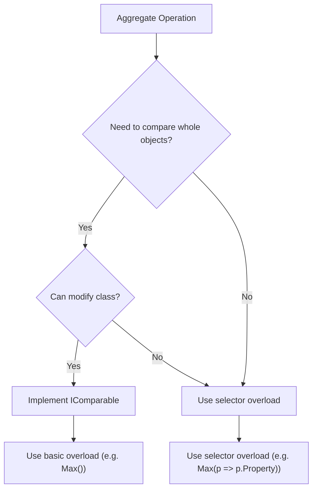

This diagram illustrates the decision process for choosing between basic and selector overloads of aggregate operators.


### Sum Operator

The Sum operator calculates the sum of a sequence of numeric values.

```csharp
var result = ProductList.Sum(p => p.UnitPrice);
```

This calculates the total value of all products in the list.

### Average Operator

The Average operator calculates the average of a sequence of numeric values.

```csharp
var result = ProductList.Average(p => p.UnitPrice);
```

This calculates the average price of all products in the list.

### Aggregate Operator

The Aggregate operator performs a custom aggregation operation on a sequence.

Basic syntax:
```csharp
var result = sequence.Aggregate(func);
```

Where `func` is a function that takes two parameters: the accumulated value and the next item in the sequence.

Example:
```csharp
string[] names = {"Aya", "Omar", "Amr", "Mohamed"};
var result = names.Aggregate((str1, str2) => $"{str1} {str2}");
Console.WriteLine(result);  // Output: "Aya Omar Amr Mohamed"
```

#### How Aggregate Works

The Aggregate operator applies an accumulator function over a sequence. Here's how it processes the above example:

1. First cycle:
   - str1 = "Aya" (first element)
   - str2 = "Omar" (second element)
   - Result: "Aya Omar"

2. Second cycle:
   - str1 = "Aya Omar" (previous result)
   - str2 = "Amr" (third element)
   - Result: "Aya Omar Amr"

3. Third cycle:
   - str1 = "Aya Omar Amr" (previous result)
   - str2 = "Mohamed" (fourth element)
   - Result: "Aya Omar Amr Mohamed"

4. No more elements, so the final result is returned.

The Aggregate operator is highly flexible and can be used for complex custom aggregations beyond simple numerical calculations.

## Comparison of Aggregate Operators

| Operator | Purpose | Example Usage |
|----------|---------|---------------|
| Count | Count elements | `ProductList.Count(p => p.UnitsInStock == 0)` |
| Max | Find maximum value | `ProductList.Max(p => p.UnitPrice)` |
| Min | Find minimum value | `ProductList.Min(p => p.UnitPrice)` |
| Sum | Calculate total | `ProductList.Sum(p => p.UnitPrice)` |
| Average | Calculate average | `ProductList.Average(p => p.UnitPrice)` |
| Aggregate | Custom aggregation | `names.Aggregate((s1, s2) => $"{s1} {s2}")` |

## Best Practices

1. Use the specific operators (Count, Max, Min, Sum, Average) when they match your needs, as they are more readable and often more efficient.
2. Use the Aggregate operator for complex custom aggregations that can't be easily achieved with the other operators.
3. Be aware that all these operators use immediate execution and will enumerate the entire sequence.
4. For large datasets, consider using async versions of these operators (e.g., `CountAsync`, `SumAsync`) when available, especially in web applications.

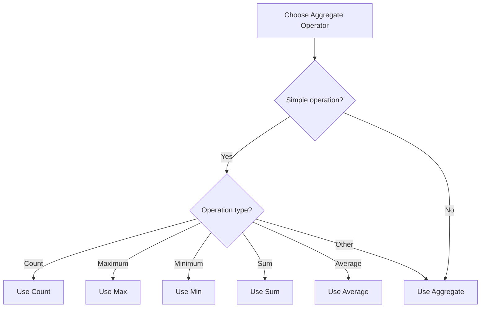

This diagram illustrates the decision process for choosing the appropriate aggregate operator based on the operation you need to perform.

# LINQ Casting Operators

Casting Operators in LINQ are part of the immediate execution category. They are used to convert LINQ query results (typically IEnumerable<T>) into specific collection types.

## Common Casting Operators

1. ToList()
2. ToArray()
3. ToDictionary()

These operators trigger immediate execution of the query and materialize the results into the specified collection type.

### ToList() Operator

Converts the result of a LINQ query to a List<T>.

```csharp
List<Product> products = ProductList.Where(p => p.UnitsInStock == 0).ToList();
```

### ToArray() Operator

Converts the result of a LINQ query to an array.

```csharp
Product[] array = ProductList.Where(p => p.UnitsInStock == 0).ToArray();
```

### ToDictionary() Operator

Converts the result of a LINQ query to a Dictionary<TKey, TValue>.

Basic usage:
```csharp
Dictionary<long, Product> dictionary = ProductList
    .Where(p => p.UnitsInStock == 0)
    .ToDictionary(p => p.ProductID);
```

#### How ToDictionary() Works

The ToDictionary() method requires you to specify a key selector function. In the example above, `p => p.ProductID` is the key selector, which tells LINQ to use the ProductID as the key in the dictionary.

1. Key Selector: `p => p.ProductID`
   - This lambda expression takes a Product (p) and returns its ProductID, which becomes the key in the dictionary.

2. Value: The entire Product object becomes the value in the dictionary.

If you want to customize the value, you can provide a value selector as well:

```csharp
Dictionary<long, string> dictionary = ProductList
    .Where(p => p.UnitsInStock == 0)
    .ToDictionary(p => p.ProductID, p => p.ProductName);
```

In this case, the dictionary will have ProductID as the key and ProductName as the value.

## Comparison of Casting Operators

| Operator | Result Type | Key Points |
|----------|-------------|------------|
| ToList() | List<T> | Flexible, allows duplicates, maintains order |
| ToArray() | T[] | Fixed size, slightly more efficient than List<T> for read-only scenarios |
| ToDictionary() | Dictionary<TKey, TValue> | Requires unique keys, fast lookup by key |

## Best Practices

1. Use ToList() when you need a mutable collection or when you're not sure about future modifications.
2. Use ToArray() when you need a fixed-size collection or for slightly better performance in read-only scenarios.
3. Use ToDictionary() when you need fast lookups based on a unique key.
4. Be aware that these operators trigger immediate execution of the query, which can impact performance for large datasets.
5. When using ToDictionary(), ensure that the key selector produces unique keys to avoid runtime exceptions.

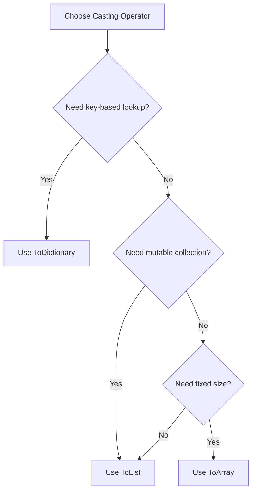

This diagram illustrates the decision process for choosing the appropriate casting operator based on your specific requirements.

## Deferred vs. Immediate Execution

It's important to note the execution behavior in LINQ queries:

1. `Where()` uses deferred execution. It doesn't execute the query immediately.
2. Casting operators (ToList(), ToArray(), ToDictionary()) trigger immediate execution.

Example:
```csharp
var query = ProductList.Where(p => p.UnitsInStock == 0); // Deferred execution
var list = query.ToList(); // Immediate execution
```

Understanding this behavior is crucial for optimizing LINQ query performance, especially when working with large datasets.


# LINQ Casting Operators and Hash-Based Collections

## Casting Operators (continued)

### ToDictionary() with Key and Value Selectors

You can create a Dictionary with custom keys and values using two selector functions:

```csharp
Dictionary<long, string> dictionary02 = ProductList
    .Where(p => p.UnitsInStock == 0)
    .ToDictionary(p => p.ProductId, p => p.ProductName);
```

In this example:
- `p => p.ProductId` is the key selector (produces a long)
- `p => p.ProductName` is the value selector (produces a string)

### ToHashSet()

Converts the result of a LINQ query to a HashSet<T>.

```csharp
HashSet<Product> hashset = ProductList
    .Where(p => p.UnitsInStock == 0)
    .ToHashSet();
```

## Hash-Based Collections

Hash-based collections in C# (like Dictionary<TKey, TValue> and HashSet<T>) use hash tables for efficient data storage and retrieval.

### How Hash Tables Work

1. Hashing: When an element is added to the collection, its key is passed through a hash function (GetHashCode() in C#) to generate a unique hash code.

2. Bucketing: The hash code is used to determine which "bucket" the element belongs to. A bucket is a group of elements with similar hash codes.

3. Storage: The element is stored in its assigned bucket.

4. Retrieval: When searching for an element, the key's hash code is calculated, the appropriate bucket is located, and then only the elements in that bucket are searched.

### Advantages of Hash-Based Collections

1. Fast Lookup: O(1) average case time complexity for insertions, deletions, and lookups.
2. Unique Keys: Ensures that each key in the collection is unique (for Dictionary and HashSet).
3. Efficient for Large Datasets: Performance remains relatively constant regardless of the number of elements.

### Dictionary vs HashSet

| Aspect | Dictionary<TKey, TValue> | HashSet<T> |
|--------|--------------------------|------------|
| Storage | Key-Value Pairs | Only Keys (Values are null) |
| Usage | When you need to associate data with keys | When you only need to store unique elements |
| Lookup | By Key | By Element (which acts as its own key) |

## Best Practices for Hash-Based Collections

1. Implement GetHashCode() and Equals() methods properly for custom types used as keys.
2. Choose an appropriate initial capacity to minimize rehashing.
3. Be aware that the order of elements is not guaranteed in hash-based collections.
4. Use Dictionary when you need to associate values with keys, and HashSet when you only need to store unique elements.

## LINQ and Hash-Based Collections

When using LINQ with hash-based collections:

1. ToHashSet() and ToDictionary() provide immediate execution, materializing the results into the respective collection types.
2. These methods are useful when you need fast lookup capabilities in your resulting collection.
3. Be cautious with large datasets, as these methods will enumerate the entire source sequence.

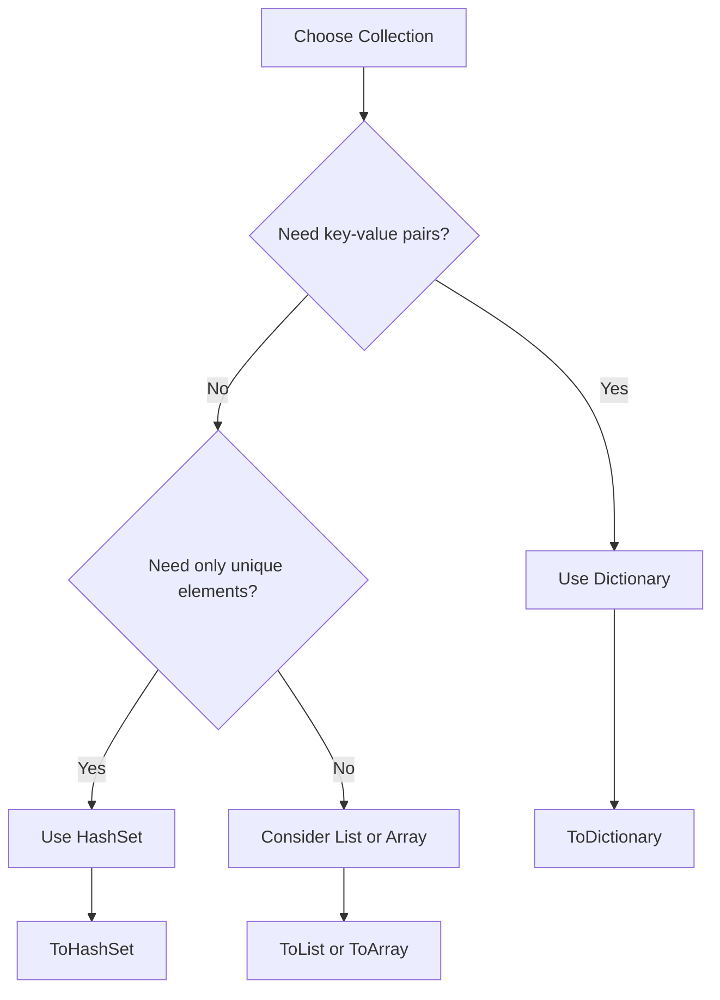

This diagram illustrates the decision process for choosing between Dictionary, HashSet, and other collection types when working with LINQ results.


# LINQ Generation Operators

## Overview
Generation operators in LINQ are special operators that create new sequences. They are:
- Only available through fluent syntax
- Called as static methods from the `Enumerable` class
- Used to generate sequences without source collections

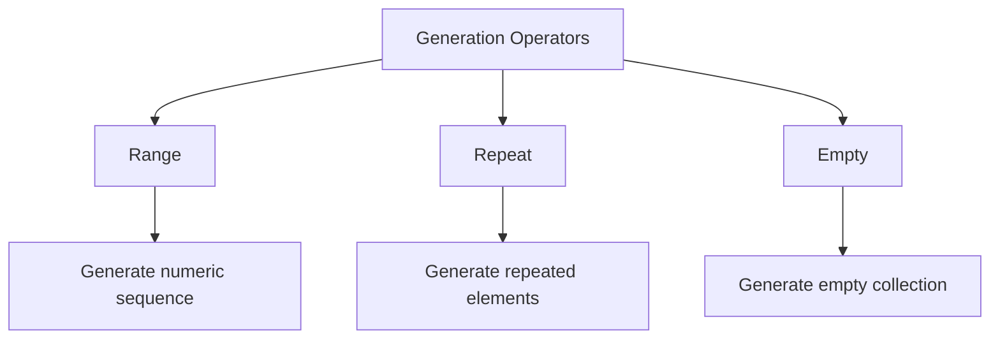

## Supported Operators

| Operator | Purpose | Syntax |
|----------|---------|--------|
| Range | Generates a sequence of numbers | `Enumerable.Range(start, count)` |
| Repeat | Generates a sequence with repeated elements | `Enumerable.Repeat(element, count)` |
| Empty | Generates an empty sequence | `Enumerable.Empty<T>()` |

## Detailed Examples

### 1. Range Operator
Generates a sequence of integers.
```csharp
// Generates numbers from 0 to 99
var Result = Enumerable.Range(0, 100);

// Display results
foreach(var item in Result)
    Console.Write($"{item} ");
```

### 2. Repeat Operator
Generates a sequence with repeated elements.
```csharp
// Repeat numeric value
var Result = Enumerable.Repeat(2, 100);  // 100 elements of value 2

// Repeat object
Result = Enumerable.Repeat(new Product(), 100);  // 100 Product instances
```

### 3. Empty Operator
Generates empty collections of specified type.

#### Empty Array Creation
```csharp
// Method 1: Using Empty operator
var arrayProduct = Enumerable.Empty<Product>().ToArray();

// Method 2: Traditional way
Product[] Products = new Product[0];
```

#### Empty List Creation
```csharp
// Method 1: Using Empty operator
var List = Enumerable.Empty<Product>().ToList();

// Method 2: Traditional way
List<Product> Products = new List<Product>();
```

## Key Characteristics

1. **Deferred Execution**: These operators implement deferred execution
2. **Static Only**: Only available as static methods from `Enumerable` class
3. **Type Safety**: Strongly typed return values
4. **No Source Required**: Can generate sequences without source collections

## Usage Guidelines

- Use `Range` when you need sequential numbers
- Use `Repeat` when you need multiple instances of the same value
- Use `Empty` when you need to initialize empty collections

## Performance Considerations

- `Empty()` is more efficient than creating new empty collections
- `Range` and `Repeat` use deferred execution, only generating values when enumerated
- Memory usage is optimized through deferred execution
# LINQ Set Operators

## Overview
Set operators in LINQ implement set theory operations on sequences. These operators use deferred execution and belong to the Union Family of operators.

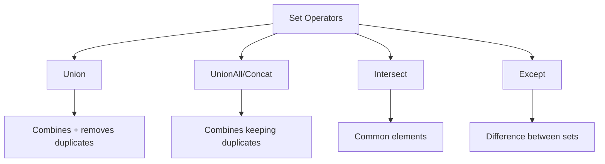

## Sample Data Setup
```csharp
// First sequence: Numbers 0-99
var Seq01 = Enumerable.Range(0, 100);

// Second sequence: Numbers 50-149
var Seq02 = Enumerable.Range(50, 100);
```

## Operator Details

### 1. Union
Combines two sequences and removes duplicates.
```csharp
var Result = Seq01.Union(Seq02); // Results: 0-149 (no duplicates)

// Union is equivalent to:
Result = Seq01.Concat(Seq02).Distinct();
```

| Operation | Input 1 | Input 2 | Result |
|-----------|---------|---------|--------|
| Union | [0-99] | [50-149] | [0-149] |

### 2. UnionAll (Concat)
Combines two sequences keeping all duplicates.
```csharp
var Result = Seq01.Concat(Seq02); // Results: 0-99, 50-149 (with duplicates)
```

| Operation | Input 1 | Input 2 | Result |
|-----------|---------|---------|--------|
| Concat | [0-99] | [50-149] | [0-99, 50-149] |

### 3. Intersect
Returns elements that exist in both sequences.
```csharp
var Result = Seq01.Intersect(Seq02); // Results: 50-99
```

| Operation | Input 1 | Input 2 | Result |
|-----------|---------|---------|--------|
| Intersect | [0-99] | [50-149] | [50-99] |

### 4. Except
Returns elements from the first sequence that don't exist in the second sequence.
```csharp
// Elements in Seq01 but not in Seq02
var Result = Seq01.Except(Seq02); // Results: 0-49

// Elements in Seq02 but not in Seq01
Result = Seq02.Except(Seq01); // Results: 100-149
```

| Operation | First Sequence | Second Sequence | Result |
|-----------|----------------|-----------------|--------|
| Except (Seq01) | [0-99] | [50-149] | [0-49] |
| Except (Seq02) | [50-149] | [0-99] | [100-149] |

## Key Characteristics

1. **Deferred Execution**: All set operators implement deferred execution
2. **Extension Methods**: Available as extension methods on `IEnumerable<T>`
3. **SQL Equivalence**: Mirror SQL set operations
4. **Order**: Result order may vary based on the implementation

## Visual Representation of Set Operations

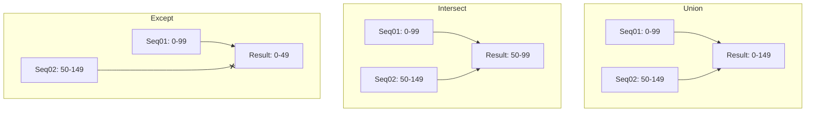

## Usage Examples
```csharp
// Display results
foreach (var item in Result)
    Console.Write($"{item} ");
```

## Common Use Cases

1. **Union**: Combining unique items from multiple sources
2. **Concat**: Appending sequences without removing duplicates
3. **Intersect**: Finding common elements
4. **Except**: Finding unique elements in one set

## Performance Considerations

- Set operations require comparisons between elements
- Large sequences may impact performance
- Consider using HashSet<T> for better performance in some scenarios


# LINQ Set Operators

## Overview
Set operators in LINQ implement set theory operations on sequences. These operators use deferred execution and belong to the Union Family of operators.

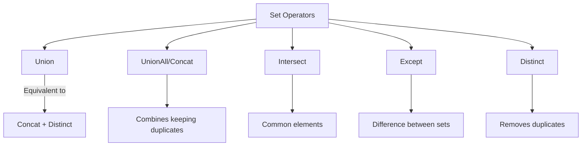

## Union and Distinct Relationship
```csharp
// These two operations are equivalent:
var Result1 = Seq01.Union(Seq02);
var Result2 = Seq01.Concat(Seq02).Distinct();
```

## Sample Data Setup
```csharp
// First sequence: Numbers 0-99
var Seq01 = Enumerable.Range(0, 100);

// Second sequence: Numbers 50-149
var Seq02 = Enumerable.Range(50, 100);
```

## Operator Details

### 1. Union
Combines two sequences and removes duplicates. Can be achieved in two ways:
```csharp
// Method 1: Direct Union
var Result = Seq01.Union(Seq02); // Results: 0-149 (no duplicates)

// Method 2: Concat + Distinct
Result = Seq01.Concat(Seq02).Distinct(); // Same result: 0-149 (no duplicates)
```

| Operation | Implementation | Result |
|-----------|---------------|---------|
| Union | Direct | [0-149] |
| Concat + Distinct | Two-step | [0-149] |

### 2. Distinct
Removes duplicate elements from a sequence.
```csharp
// Remove duplicates from a sequence
var duplicateSequence = Seq01.Concat(Seq02); // Contains duplicates (50-99 appear twice)
var uniqueSequence = duplicateSequence.Distinct(); // Removes duplicates
```

Example with duplicate numbers:
```csharp
var numbersWithDuplicates = new[] { 1, 1, 2, 3, 3, 4, 5, 5 };
var uniqueNumbers = numbersWithDuplicates.Distinct(); // Results: 1, 2, 3, 4, 5
```

### 3. UnionAll (Concat)
Combines two sequences keeping all duplicates.
```csharp
var Result = Seq01.Concat(Seq02); // Results: 0-99, 50-149 (with duplicates)
```

### 4. Intersect
Returns elements that exist in both sequences.
```csharp
var Result = Seq01.Intersect(Seq02); // Results: 50-99
```

### 5. Except
Returns elements from the first sequence that don't exist in the second sequence.
```csharp
// Elements in Seq01 but not in Seq02
var Result = Seq01.Except(Seq02); // Results: 0-49

// Elements in Seq02 but not in Seq01
Result = Seq02.Except(Seq01); // Results: 100-149
```

## Visual Representation of Union vs Concat+Distinct

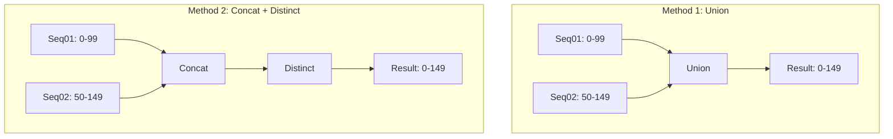

## Key Points About Union and Distinct

1. **Union = Concat + Distinct**
   - Union automatically removes duplicates
   - Same result can be achieved by concatenating and then removing duplicates

2. **When to Use Each Approach**
   - Use Union when you want a single operation
   - Use Concat + Distinct when you need more control or want to perform operations between steps

3. **Performance Considerations**
   - Union might be more optimized internally
   - Concat + Distinct requires two separate operations
   - Both achieve the same result but might have different performance characteristics with large datasets

## Display Results
```csharp
// Display results
foreach (var item in Result)
    Console.Write($"{item} ");
```


# LINQ Quantifier Operators

## Overview
Quantifier operators in LINQ are used to check conditions across sequences and return boolean results. These operators help validate sequence contents and compare sequences.

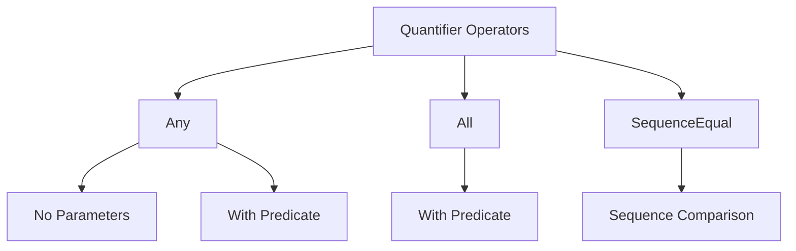

## 1. Any Operator

### Basic Usage (No Parameters)
Checks if a sequence contains any elements.

```csharp
var ProductList = GetProducts(); // Assume this returns a list of products
var Result = ProductList.Any();

// Returns true if list has at least one element
// Returns false if list is empty
Console.WriteLine(Result);
```

### With Predicate
Checks if any element matches a specific condition.

```csharp
// Check for products out of stock
Result = ProductList.Any(P => P.UnitInStock == 0);

// Check for products with high inventory
Result = ProductList.Any(P => P.UnitInStock > 1000);
```

| Usage | Returns True When | Example |
|-------|------------------|---------|
| `Any()` | Sequence has any elements | `ProductList.Any()` |
| `Any(predicate)` | At least one element matches condition | `ProductList.Any(p => p.UnitInStock == 0)` |

## 2. All Operator

Takes a predicate and checks if all elements match the condition.

```csharp
// Check if all products are out of stock
Result = ProductList.All(P => P.UnitInStock == 0);
```

| Usage | Returns True When | Example |
|-------|------------------|---------|
| `All(predicate)` | Every element matches condition | `ProductList.All(p => p.UnitInStock > 0)` |

## 3. SequenceEqual Operator

Compares two sequences for equality.

```csharp
// Sample sequences
var Seq01 = Enumerable.Range(0, 100);  // 0-99
var Seq02 = Enumerable.Range(50, 100); // 50-149

// Compare sequences
Result = Seq01.SequenceEqual(Seq02);  // False
```

### How SequenceEqual Works
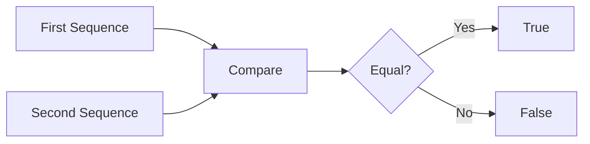

## Comparison of Operators

| Operator | Purpose | Returns True When |
|----------|---------|------------------|
| Any() | Check for elements | Sequence contains any elements |
| Any(predicate) | Check for matching elements | At least one element matches condition |
| All(predicate) | Check all elements | All elements match condition |
| SequenceEqual | Compare sequences | Sequences have same elements in same order |

## Usage Examples

### 1. Basic Existence Check
```csharp
if (products.Any())
{
    Console.WriteLine("Product list is not empty");
}
```

### 2. Condition Check
```csharp
// Check for out-of-stock products
if (products.Any(p => p.UnitInStock == 0))
{
    Console.WriteLine("Some products are out of stock");
}

// Check if all products are in stock
if (products.All(p => p.UnitInStock > 0))
{
    Console.WriteLine("All products are in stock");
}
```

### 3. Sequence Comparison
```csharp
var sequence1 = new[] { 1, 2, 3 };
var sequence2 = new[] { 1, 2, 3 };
var areEqual = sequence1.SequenceEqual(sequence2); // True
```

## Key Points

1. **Return Type**
   - All quantifier operators return `bool`
   - Results are immediate (no deferred execution)

2. **Performance Considerations**
   - `Any()` stops at first matching element
   - `All()` stops at first non-matching element
   - `SequenceEqual` must check all elements

3. **Best Practices**
   - Use `Any()` instead of `Count() > 0`
   - Use `Any(predicate)` instead of `Count(predicate) > 0`
   - Consider null checks before using these operators

4. **Common Use Cases**
   - Validation checks
   - Business rule enforcement
   - Sequence comparison
   - Collection emptiness checks
