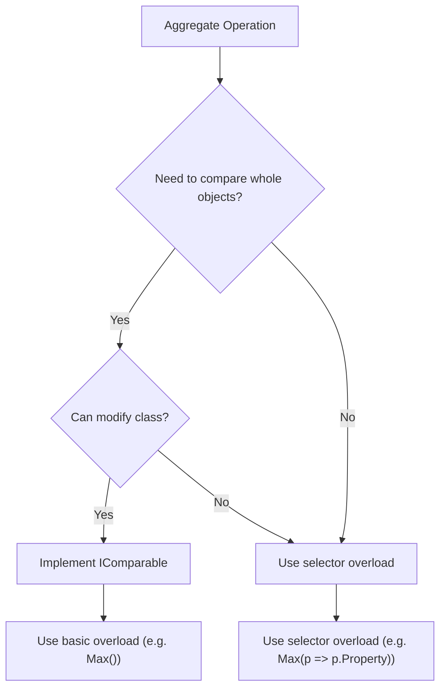
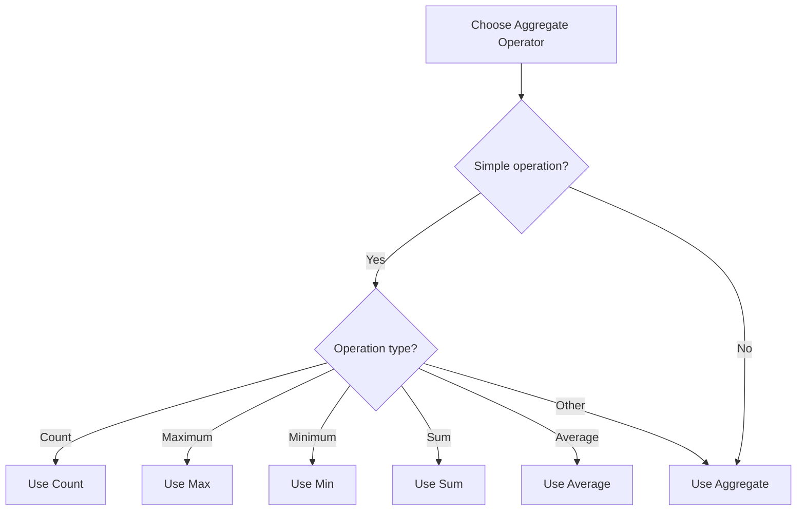

# LINQ Aggregate Operators

Aggregate operators in LINQ perform calculations on a sequence and return a single value. They use immediate execution, meaning the query is evaluated as soon as the operator is called.

## Common Aggregate Operators

1. Count
2. Max
3. Min
4. Sum
5. Average
6. Aggregate

### Count Operator

The Count operator returns the number of elements in a sequence.

#### Basic Usage

```csharp
var result = ProductList.Count();  // LINQ Operator 
var result = ProductList.Count;    // List Property
```

#### Count with Predicate

```csharp
var result = ProductList.Count(p => p.UnitsInStock == 0);
Console.WriteLine(result);
```

### Max Operator

The Max operator returns the maximum value in a sequence.

#### Basic Usage

```csharp
var result = ProductList.Max();
Console.WriteLine(result);
```

Note: This usage requires the Product class to implement IComparable<Product>.

#### Max with Selector

```csharp
var result = ProductList.Max(p => p.ProductName.Length);
```

### Min Operator

The Min operator returns the minimum value in a sequence.

#### Basic Usage

```csharp
var result = ProductList.Min();
```

Note: This usage requires the Product class to implement IComparable<Product>.

#### Min with Selector

```csharp
var result = ProductList.Min(p => p.ProductName.Length);
```

### Implementing IComparable<Product>

For the basic usage of Max and Min, the Product class must implement IComparable<Product>:

```csharp
public class Product : IComparable<Product>
{
    // ... other properties ...

    public int CompareTo(Product? other)
    {
        return this.UnitPrice.CompareTo(other?.UnitPrice);
    }
}
```

### Combining Aggregate Operators

You can combine aggregate operators with other LINQ methods for more complex queries:

```csharp
var minLength = ProductList.Min(p => p.ProductName.Length);

var result = (from p in ProductList
              where p.ProductName.Length == minLength
              select p).FirstOrDefault();

Console.WriteLine(result);
```

## Comparison: Basic Usage vs. Selector Usage

| Aspect | Basic Usage (e.g., Max()) | Selector Usage (e.g., Max(p => p.Property)) |
|--------|---------------------------|---------------------------------------------|
| IComparable Requirement | Yes | No |
| Flexibility | Less (compares whole objects) | More (can compare specific properties) |
| Ease of Use | Simple, but requires class modification | More verbose, but doesn't require class modification |

## Best Practices

1. Implement IComparable<T> in your class if you frequently need to compare whole objects.
2. Use selector overloads (e.g., Max(p => p.Property)) when you need to compare based on specific properties or when you can't modify the class.
3. Combine aggregate operators with other LINQ methods for more complex queries.



This diagram illustrates the decision process for choosing between basic and selector overloads of aggregate operators.


### Sum Operator

The Sum operator calculates the sum of a sequence of numeric values.

```csharp
var result = ProductList.Sum(p => p.UnitPrice);
```

This calculates the total value of all products in the list.

### Average Operator

The Average operator calculates the average of a sequence of numeric values.

```csharp
var result = ProductList.Average(p => p.UnitPrice);
```

This calculates the average price of all products in the list.

### Aggregate Operator

The Aggregate operator performs a custom aggregation operation on a sequence.

Basic syntax:
```csharp
var result = sequence.Aggregate(func);
```

Where `func` is a function that takes two parameters: the accumulated value and the next item in the sequence.

Example:
```csharp
string[] names = {"Aya", "Omar", "Amr", "Mohamed"};
var result = names.Aggregate((str1, str2) => $"{str1} {str2}");
Console.WriteLine(result);  // Output: "Aya Omar Amr Mohamed"
```

#### How Aggregate Works

The Aggregate operator applies an accumulator function over a sequence. Here's how it processes the above example:

1. First cycle:
   - str1 = "Aya" (first element)
   - str2 = "Omar" (second element)
   - Result: "Aya Omar"

2. Second cycle:
   - str1 = "Aya Omar" (previous result)
   - str2 = "Amr" (third element)
   - Result: "Aya Omar Amr"

3. Third cycle:
   - str1 = "Aya Omar Amr" (previous result)
   - str2 = "Mohamed" (fourth element)
   - Result: "Aya Omar Amr Mohamed"

4. No more elements, so the final result is returned.

The Aggregate operator is highly flexible and can be used for complex custom aggregations beyond simple numerical calculations.

## Comparison of Aggregate Operators

| Operator | Purpose | Example Usage |
|----------|---------|---------------|
| Count | Count elements | `ProductList.Count(p => p.UnitsInStock == 0)` |
| Max | Find maximum value | `ProductList.Max(p => p.UnitPrice)` |
| Min | Find minimum value | `ProductList.Min(p => p.UnitPrice)` |
| Sum | Calculate total | `ProductList.Sum(p => p.UnitPrice)` |
| Average | Calculate average | `ProductList.Average(p => p.UnitPrice)` |
| Aggregate | Custom aggregation | `names.Aggregate((s1, s2) => $"{s1} {s2}")` |

## Best Practices

1. Use the specific operators (Count, Max, Min, Sum, Average) when they match your needs, as they are more readable and often more efficient.
2. Use the Aggregate operator for complex custom aggregations that can't be easily achieved with the other operators.
3. Be aware that all these operators use immediate execution and will enumerate the entire sequence.
4. For large datasets, consider using async versions of these operators (e.g., `CountAsync`, `SumAsync`) when available, especially in web applications.



This diagram illustrates the decision process for choosing the appropriate aggregate operator based on the operation you need to perform.
